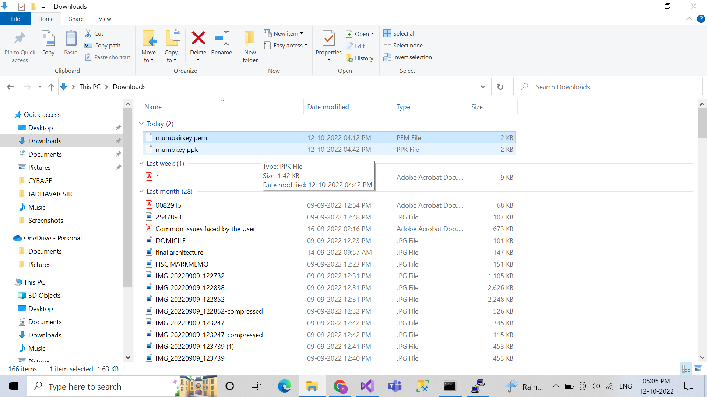
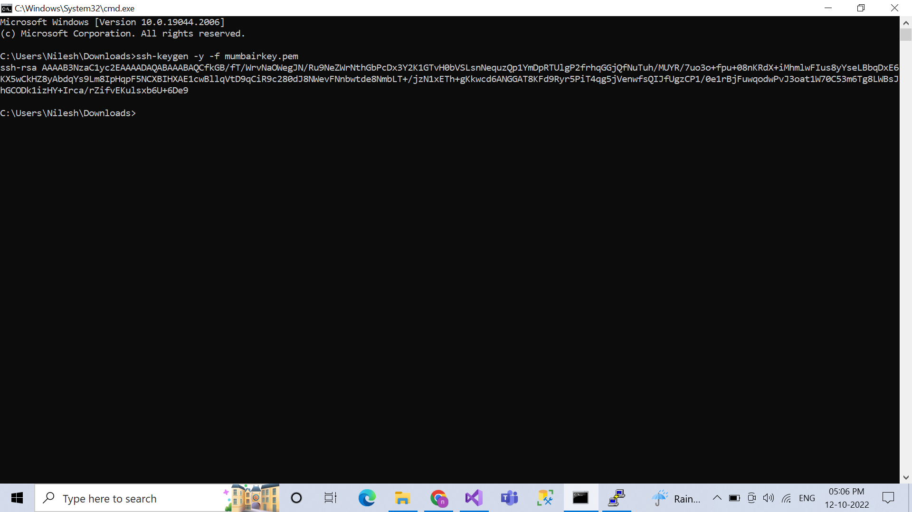
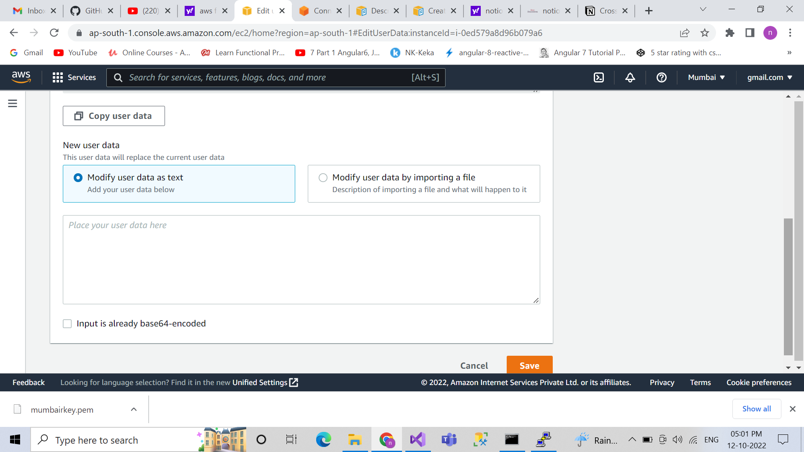

# How to access EC2 instace if lost key-pair

<aside>
 create new key-pair

</aside>

- click on instance
- in detail-click on key
- create new key-select pem -save

<aside>
 for check jenkins status:- sudo systemctl status jenkins

</aside>

step 2

- in window goto download folder (loaction of newkey download )<aside>
 create new key-pair

</aside>

- click on instance
- in detail-click on key
- create new key-select pem -save

<aside>
💡 for check jenkins status:- sudo systemctl status jenkins

</aside>

step 2

- in window goto download folder (loaction of newkey download )



- open cmd
- type following command :ssh-keygen -y -f .pemkey



<aside>
💡 step-3

</aside>

- stop instace
- click on action
- instace setting
- edit user data
- list



- paset foolowing code in modify data as code

```jsx
Content-Type: multipart/mixed; boundary="//"
MIME-Version: 1.0

--//
Content-Type: text/cloud-config; charset="us-ascii"
MIME-Version: 1.0
Content-Transfer-Encoding: 7bit
Content-Disposition: attachment; filename="cloud-config.txt"

#cloud-config
cloud_final_modules:
- [users-groups, once]
users:
  - name: ubuntu(type user name)
    ssh-authorized-keys: 
    - ssh-rsa AAAAB3NzaC1yc2EAAAADAQABAAABAQCfkGB/fT/WrvNaOWegJN/Ru9NeZWrNthGbPcDx3Y2K1GTvH0bVSLsnNequzQp1YmDpRTUlgP2frhqGGjQfNuTuh/MUYR/7uo3o+fpu+08nKRdX+iMhmlwFIus8yYseLBbqDxE6KX5wCkHZ8yAbdqYs9Lm8IpHqpF5NCXBIHXAE1cwBllqVtD9qCiR9c280dJ8NWevFNnbwtde8NmbLT+/jzN1xETh+gKkwcd6ANGGAT8KFd9Ryr5PiT4qg5jVenwfsQIJfUgzCP1/0e1rBjFuwqodwPvJ3oat1W70C53m6Tg8LWBsJhGCODk1izHY+Irca/rZifvEKulsxb6U+6De9(copy genereted key PublicKeypair here)
```

<aside>
💡 step 4

</aside>

- start ec2
- stop ec2
- goto -action-instance security-edit user data-remove code-save
- start ec2-connect with new keypair by generating ppk file through putty