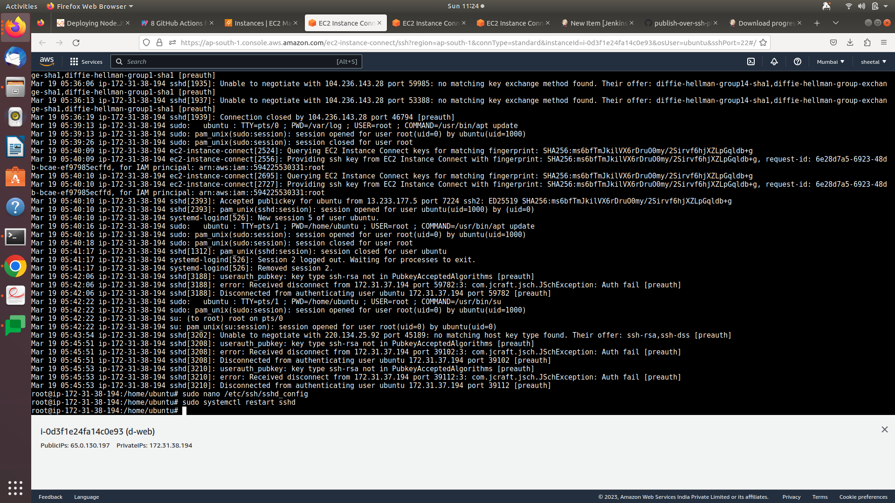

# Publish-over-ssh error sloution

<aside>
💡 authentication faile

</aside>



```bash
Mar 19 05:43:54 ip-172-31-38-194 sshd[3202]: Unable to negotiate with 220.134.25.92 port 45189: no matching host key type found. Their offer: ssh-rsa,ssh-dss [preauth]
Mar 19 05:45:51 ip-172-31-38-194 sshd[3208]: userauth_pubkey: key type ssh-rsa not in PubkeyAcceptedAlgorithms [preauth]
Mar 19 05:45:51 ip-172-31-38-194 sshd[3208]: error: Received disconnect from 172.31.37.194 port 39102:3: com.jcraft.jsch.JSchException: Auth fail [preauth]
Mar 19 05:45:51 ip-172-31-38-194 sshd[3208]: Disconnected from authenticating user ubuntu 172.31.37.194 port 39102 [preauth]
Mar 19 05:45:53 ip-172-31-38-194 sshd[3210]: userauth_pubkey: key type ssh-rsa not in PubkeyAcceptedAlgorithms [preauth]
Mar 19 05:45:53 ip-172-31-38-194 sshd[3210]: error: Received disconnect from 172.31.37.194 port 39112:3: com.jcraft.jsch.JSchException: Auth fail [preauth]
Mar 19 05:45:53 ip-172-31-38-194 sshd[3210]: Disconnected from authenticating user ubuntu 172.31.37.194 port 39112 [preauth]
```

<aside>
💡 solution

</aside>

- go to remote server to check log
- To check the SSH key types allowed on the server, you can look at the SSH server configuration file located at **`/etc/ssh/sshd_config`**

```bash
sudo nano /etc/ssh/sshd_config

```

- Once you have opened the file, look for the **`PubkeyAcceptedAlgorithms`** line. This line lists the key types that are accepted by the SSH server.
- If the **`ssh-rsa`** key type is not listed, then that could be the reason for the error you are seeing. In that case, you can add it to the list of accepted key types.
- To do this, add the following line to the **`sshd_config`** file:

```bash
PubkeyAcceptedAlgorithms ssh-rsa
sudo systemctl restart sshd
```