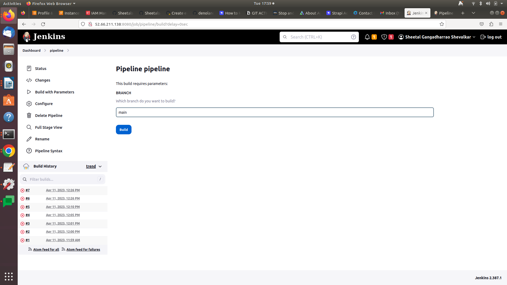

```yaml
pipeline {
    agent any

    parameters {
        string(name: 'BRANCH', defaultValue: 'main', description: 'Which branch do you want to build?')
    }

    stages {
        stage('Checkout') {
            steps {
                checkout([$class: 'GitSCM', branches: [[name: "${params.BRANCH}"]], userRemoteConfigs: [[url: 'https://github.com/Sheetalsgs/nodeapp.git']]])
            }
        }
        stage('Build and Package') {
            steps {
                sh 'npm install'
                sh 'npm run build'
                sh 'cd build && zip -r ../build.zip *'
            }
        }
        stage('Deploy') {
            steps {
                // Start SSH agent
                sshagent(credentials: ['9229d7e2-1053-45f3-a0a4-d5cc049f6f05']) {
                    // Run SSH commands within this block
                    sh 'scp -o StrictHostKeyChecking=no build.zip sheetal@13.127.222.221:/var/www/html/myapp'
                    sh 'ssh -o StrictHostKeyChecking=no sheetal@13.127.222.221 "cd /var/www/html/myapp; rm -rf asset-manifest.json  favicon.ico  index.html  logo192.png  logo512.png  manifest.json  robots.txt  static; unzip build.zip; rm -rf build.zip"'
                    sh 'ssh -t -o StrictHostKeyChecking=no ubuntu@13.127.222.221 sudo service nginx restart'

                }
            }
        }
    }
}
```

<aside>
💡 output

</aside>

