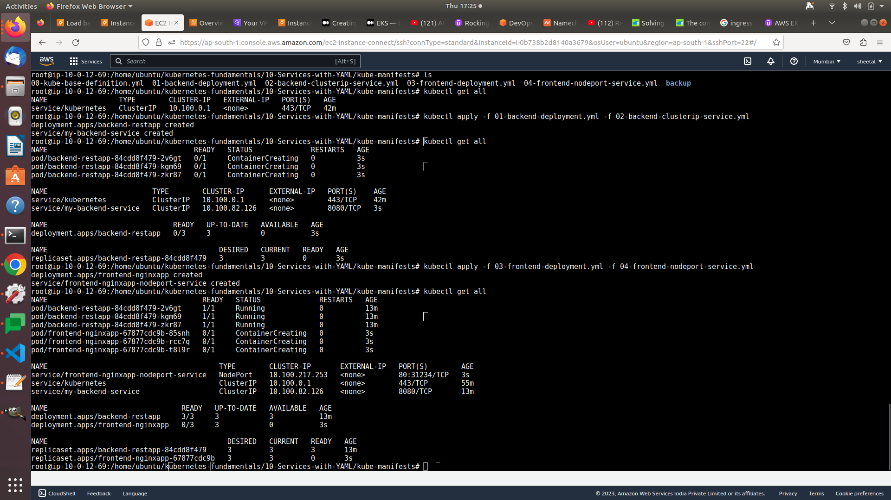

# Create Backend Deployment & Cluster IP Service

<aside>
💡 create 2 pods with backend app, and frontend app

</aside>

- Write the Deployment template for backend REST application.
- Write the Cluster IP service template for backend REST application.
- **Important Notes:**
    - Name of Cluster IP service should be `name: my-backend-service` because same is configured in frontend nginx reverse proxy `default.conf`.

```jsx
cd kubernetes-fundamentals\10-Services-with-YAML\kube-manifests
kubectl get all
kubectl apply -f 01-backend-deployment.yml -f 02-backend-clusterip-service.yml
kubectl get all

```

```yaml
#01-backend-deployment.yml
apiVersion: apps/v1
kind: Deployment
metadata:
  name: backend-restapp
  labels: 
    app: backend-restapp
    tier: backend
spec:
  replicas: 3
  selector:
    matchLabels:
      app: backend-restapp
  template: 
    metadata:
      labels:
        app: backend-restapp
        tier: backend
    spec:
      containers:
        - name: backend-restapp
          image: stacksimplify/kube-helloworld:1.0.0
          ports:
            - containerPort: 8080
```

```yaml
#02-backend-clusterip-service.yml
apiVersion: v1
kind: Service
metadata:
  name: my-backend-service ## VERY VERY IMPORTANT - NGINX PROXYPASS needs this name
  labels: 
    app: backend-restapp
    tier: backend
spec:
  #type: Cluster IP is a default service
  selector:
    app: backend-restapp
  ports: 
    - name: http
      port: 8080 # ClusterIp Service Port
      targetPort: 8080 # Container Port
```

**Step-02: Create Frontend Deployment & NodePort Service**

- Write the Deployment template for frontend Nginx Application
- Write the NodePort service template for frontend Nginx Application

```jsx
cd kubernetes-fundamentals\10-Services-with-YAML\kube-manifests
kubectl get all
kubectl apply -f 03-frontend-deployment.yml -f 04-frontend-nodeport-service.yml
kubectl get all
```

<aside>
💡 **Access REST Application**

</aside>

```jsx
# Get External IP of nodes using
kubectl get nodes -o wide

# Access REST Application  (Port is static 31234 configured in frontend service template)
http://<node1-public-ip>:31234/hello
```

```yaml
#03-frontend-deployment.yml
apiVersion: apps/v1
kind: Deployment
metadata:
  name: frontend-nginxapp
  labels: 
    app: frontend-nginxapp
    tier: frontend
spec:
  replicas: 3
  selector:
    matchLabels:
      app: frontend-nginxapp
  template: 
    metadata:
      labels:
        app: frontend-nginxapp
        tier: frontend
    spec:
      containers:
        - name: frontend-nginxapp
          image: stacksimplify/kube-frontend-nginx:1.0.0
          ports:
            - containerPort: 80
```

```yaml
#04-frontend-nodeport-service.yml
apiVersion: v1
kind: Service
metadata:
  name: frontend-nginxapp-nodeport-service
  labels: 
    app: frontend-nginxapp
    tier: frontend     
spec:
  type: NodePort 
  selector:
    app: frontend-nginxapp
  ports: 
    - name: http
      port: 80
      targetPort: 80
      nodePort: 31234
```



<aside>
💡 output

</aside>

```yaml
root@ip-10-0-12-69:/home/ubuntu/kubernetes-fundamentals/10-Services-with-YAML# cd kube-manifests/
root@ip-10-0-12-69:/home/ubuntu/kubernetes-fundamentals/10-Services-with-YAML/kube-manifests# kubectl get svc
NAME                                 TYPE        CLUSTER-IP       EXTERNAL-IP   PORT(S)        AGE
frontend-nginxapp-nodeport-service   NodePort    10.100.217.253   <none>        80:31234/TCP   65s
kubernetes                           ClusterIP   10.100.0.1       <none>        443/TCP        56m
my-backend-service                   ClusterIP   10.100.82.126    <none>        8080/TCP       14m
root@ip-10-0-12-69:/home/ubuntu/kubernetes-fundamentals/10-Services-with-YAML/kube-manifests# kubectl get pods
NAME                                 READY   STATUS    RESTARTS   AGE
backend-restapp-84cdd8f479-2v6gt     1/1     Running   0          14m
backend-restapp-84cdd8f479-kgm69     1/1     Running   0          14m
backend-restapp-84cdd8f479-zkr87     1/1     Running   0          14m
frontend-nginxapp-67877cdc9b-85snh   1/1     Running   0          77s
frontend-nginxapp-67877cdc9b-rcc7q   1/1     Running   0          77s
frontend-nginxapp-67877cdc9b-t8l9r   1/1     Running   0          77s
root@ip-10-0-12-69:/home/ubuntu/kubernetes-fundamentals/10-Services-with-YAML/kube-manifests#
```