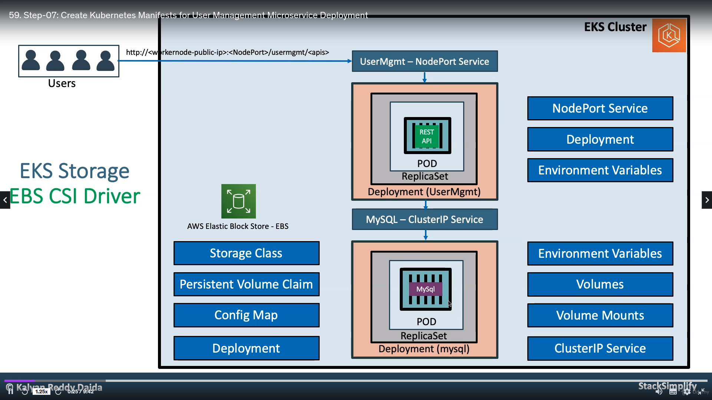

# Create Kubernetes Manifests for User Management Microservice Deployment



<aside>
 We are going to deploy a **User Management Microservice** which will connect to MySQL Database schema **usermgmt** during startup.

</aside>

- Then we can test the following APIs
    - Create Users
    - List Users
    - Delete User
    - Health Status

| Kubernetes Object | YAML File |
| --- | --- |
| Deployment, Environment Variables | 06-UserManagementMicroservice-Deployment.yml |
| NodePort Service | 07-UserManagement-Service.yml |

<aside>
💡 **Create User Management Microservice Deployment manifest**

</aside>

- **Environment Variables**

| Key Name | Value |
| --- | --- |
| DB_HOSTNAME | mysql |
| DB_PORT | 3306 |
| DB_NAME | usermgmt |
| DB_USERNAME | root |
| DB_PASSWORD | dbpassword11 |

```yaml
apiVersion: apps/v1
kind: Deployment 
metadata:
  name: usermgmt-microservice
  labels:
    app: usermgmt-restapp
spec:
  replicas: 1
  selector:
    matchLabels:
      app: usermgmt-restapp
  template:  
    metadata:
      labels: 
        app: usermgmt-restapp
    spec:
      containers:
        - name: usermgmt-restapp
          image: stacksimplify/kube-usermanagement-microservice:1.0.0
          ports: 
            - containerPort: 8095           
          env:
            - name: DB_HOSTNAME
              value: "mysql"            
            - name: DB_PORT
              value: "3306"            
            - name: DB_NAME
              value: "usermgmt"            
            - name: DB_USERNAME
              value: "root"            
            - name: DB_PASSWORD
              value: "dbpassword11"
```

<aside>
💡 **Create User Management Microservice NodePort Service manifest**

</aside>

```yaml
apiVersion: v1
kind: Service
metadata:
  name: usermgmt-restapp-service
  labels: 
    app: usermgmt-restapp
spec:
  type: NodePort
  selector:
    app: usermgmt-restapp
  ports: 
    - port: 8095
      targetPort: 8095
      nodePort: 31231
```

<aside>
💡

use storageclass,deployment,configmap,file from previous folder the create this

</aside>

```yaml
# Create Deployment & NodePort Service
kubectl apply -f kube-manifests/

# List Pods
kubectl get pods

# Verify logs of Usermgmt Microservice pod
kubectl logs -f <Pod-Name>

# Verify sc, pvc, pv
kubectl get sc,pvc,pv
```

<aside>
💡 **Problem Observation:**

- If we deploy all manifests at a time, by the time mysql is ready our `User Management Microservice` pod will be restarting multiple times due to unavailability of Database.
- To avoid such situations, we can apply `initContainers` concept to our User management Microservice `Deployment manifest`.
- We will see that in our next section but for now lets continue to test the application
</aside>

<aside>
💡 **Access Application**

</aside>

```yaml
# List Services
kubectl get svc

# Get Public IP
kubectl get nodes -o wide

# Access Health Status API for User Management Service
http://<EKS-WorkerNode-Public-IP>:31231/usermgmt/health-status
```

<aside>
💡 **Test User Management Microservice using Postman**

</aside>

### Download Postman client

```yaml
https://www.postman.com/downloads/
```

### Import Project to Postman

- Import the postman project `AWS-EKS-Masterclass-Microservices.postman_collection.json` present in folder `04-03-UserManagement-MicroService-with-MySQLDB`

### Create Environment in postman

- Go to Settings -> Click on Add
- **Environment Name:** UMS-NodePort
    - **Variable:** url
    - **Initial Value:** [http://WorkerNode-Public-IP:31231](http://workernode-public-ip:31231/)
    - **Current Value:** [http://WorkerNode-Public-IP:31231](http://workernode-public-ip:31231/)
    - Click on **Add**

### Test User Management Services

- Select the environment before calling any API
- **Health Status API**
    - URL: `{{url}}/usermgmt/health-status`
- **Create User Service**
    - URL: `{{url}}/usermgmt/user`
    - `url` variable will replaced from environment we selected

    `{
        "username": "admin1",
        "email": "dkalyanreddy@gmail.com",
        "role": "ROLE_ADMIN",
        "enabled": true,
        "firstname": "fname1",
        "lastname": "lname1",
        "password": "Pass@123"
    }`

- **List User Service**
    - URL: `{{url}}/usermgmt/users`
- **Update User Service**
    - URL: `{{url}}/usermgmt/user`

    `{
        "username": "admin1",
        "email": "dkalyanreddy@gmail.com",
        "role": "ROLE_ADMIN",
        "enabled": true,
        "firstname": "fname2",
        "lastname": "lname2",
        "password": "Pass@123"
    }`

- **Delete User Service**
    - URL: `{{url}}/usermgmt/user/admin1`

## Step-05: Verify Users in MySQL Database

`# Connect to MYSQL Database
kubectl run -it --rm --image=mysql:5.6 --restart=Never mysql-client -- mysql -h mysql -u root -pdbpassword11

# Verify usermgmt schema got created which we provided in ConfigMap
mysql> show schemas;
mysql> use usermgmt;
mysql> show tables;
mysql> select * from users;`

## Step-06: Clean-Up

- Delete all k8s objects created as part of this section

`# Delete All
kubectl delete -f kube-manifests/

# List Pods
kubectl get pods

# Verify sc, pvc, pv
kubectl get sc,pvc,pv`