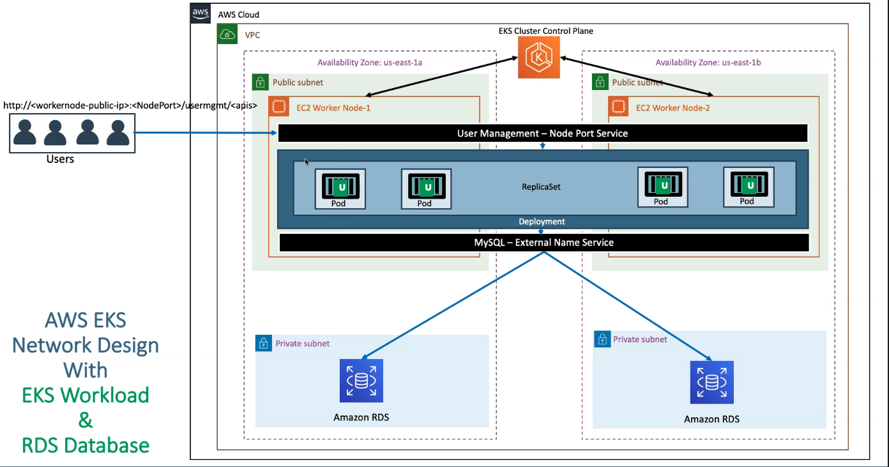
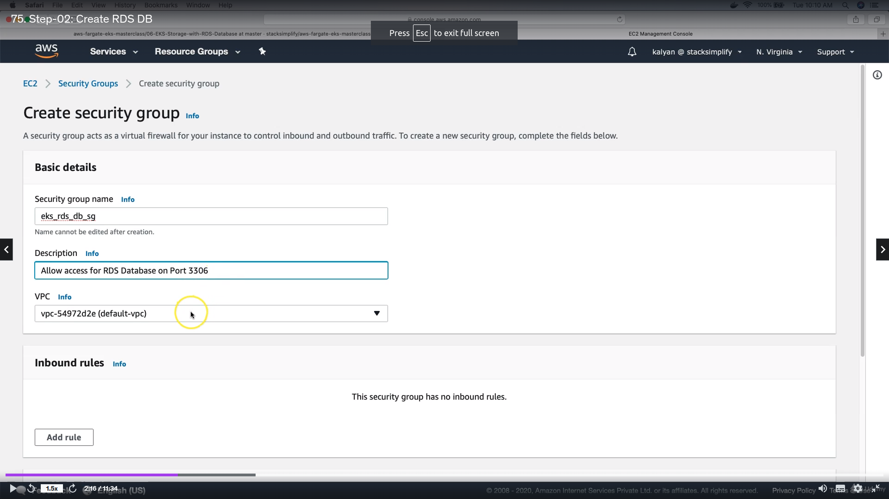
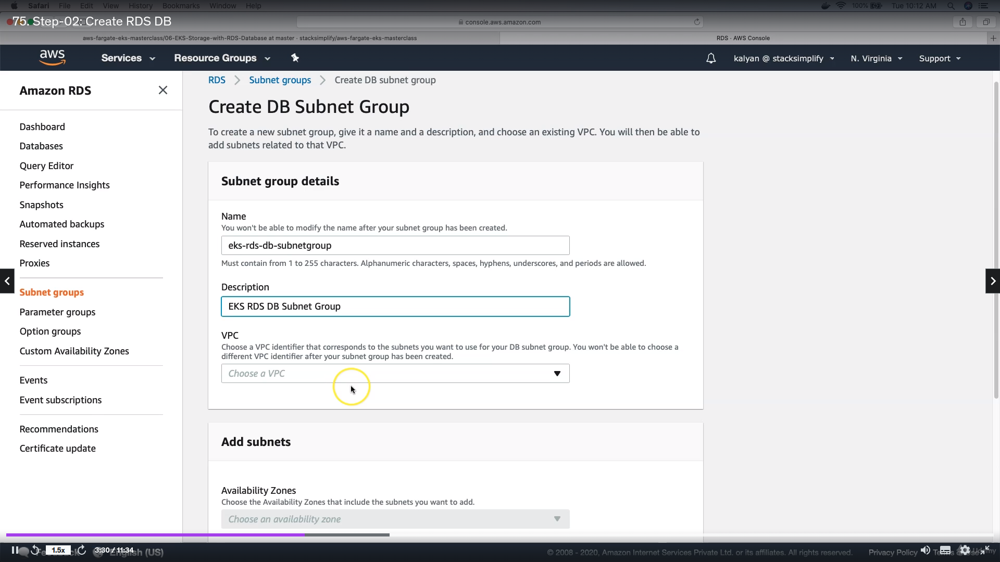
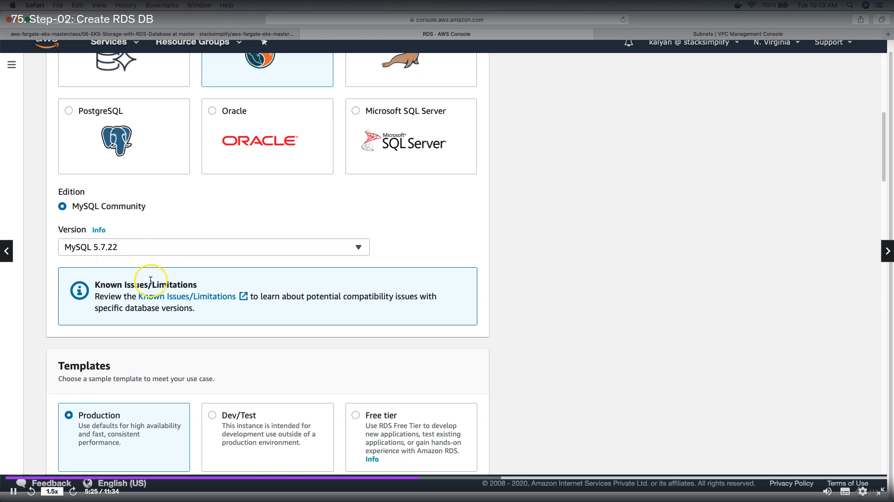
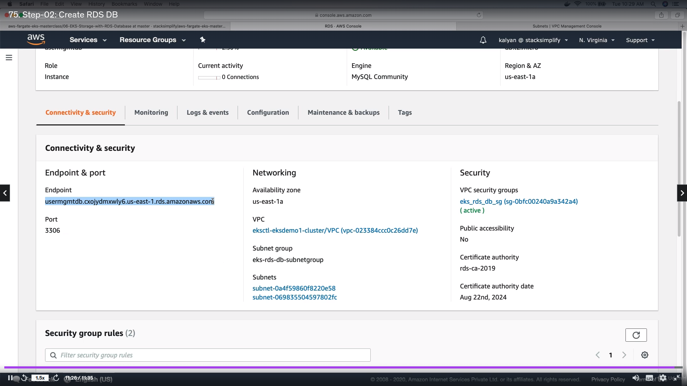

# RDS with EKS



<aside>
💡 create security group for rds by allowing port 3306

</aside>



<aside>
💡 create db subnet group in rds

</aside>



<aside>
💡 create rds database

</aside>







<aside>
💡 Create k8s externelName service manifest and deploy

</aside>

```yaml
#MySQL-externalName-Service.yml
apiVersion: v1
kind: Service
metadata:
  name: mysql
spec:
  type: ExternalName
  externalName: usermgmtdb.cxojydmxwly6.us-east-1.rds.amazonaws.com
```

```yaml
kubectl apply -f kube-manifests/01-MySQL-externalName-Service.yml
```
```