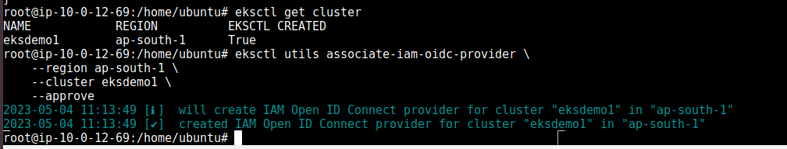
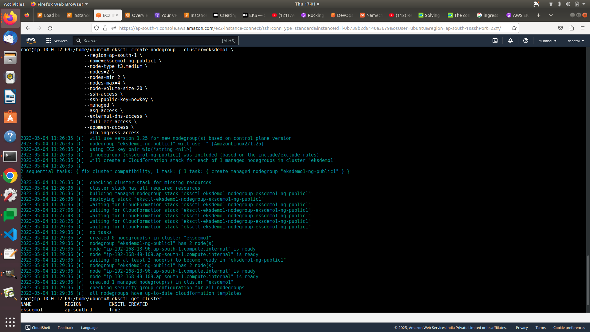

# Create EKS using EKCTL

<aside>
💡 install aws cli, ekctl,kubectl on client machine #machine requirment should be minimum 2 vcpu

</aside>    

```jsx
# kubectl v 1.26
curl -O https://s3.us-west-2.amazonaws.com/amazon-eks/1.26.2/2023-03-17/bin/linux/amd64/kubectl
# optional to check kubectl installed
curl -O https://s3.us-west-2.amazonaws.com/amazon-eks/1.26.2/2023-03-17/bin/linux/amd64/kubectl.sha256
sha256sum -c kubectl.sha256
chmod +x ./kubectl
mkdir -p $HOME/bin && cp ./kubectl $HOME/bin/kubectl && export PATH=$PATH:$HOME/bin
echo 'export PATH=$PATH:$HOME/bin' >> ~/.bashrc
kubectl version --short --client
```

<aside>
💡 install ekctl

</aside>

```jsx
# for ARM systems, set ARCH to: `arm64`, `armv6` or `armv7`
ARCH=amd64
PLATFORM=$(uname -s)_$ARCH

curl -sLO "https://github.com/weaveworks/eksctl/releases/latest/download/eksctl_$PLATFORM.tar.gz"

# (Optional) Verify checksum
curl -sL "https://github.com/weaveworks/eksctl/releases/latest/download/eksctl_checksums.txt" | grep $PLATFORM | sha256sum --check

tar -xzf eksctl_$PLATFORM.tar.gz -C /tmp && rm eksctl_$PLATFORM.tar.gz

sudo mv /tmp/eksctl /usr/local/bin
```

<aside>
💡 install aws cli

</aside>

```jsx
curl "https://awscli.amazonaws.com/awscli-exe-linux-x86_64.zip" -o "awscliv2.zip"
unzip awscliv2.zip
sudo ./aws/install
```

<aside>
💡 create cluster using ekctl command

</aside>

```jsx
aws configure
#Test if AWS CLI is working after configuring the above
aws ec2 describe-vpcs
eksctl create cluster --name=eksdemo1 \
                      --region=ap-south-1 \
                      --zones=ap-south-1a,ap-south-1b \
                      --without-nodegroup
# Get List of clusters
eksctl get cluster
```

<aside>
💡 **Step-02: Create & Associate IAM OIDC Provider for our EKS Cluster**

</aside>

- To enable and use AWS IAM roles for Kubernetes service accounts on
our EKS cluster, we must create & associate OIDC identity provider.
- To do so using `eksctl` we can use the below command.
- Use latest eksctl version (as on today the latest version is `0.21.0`)

```jsx
# Template
eksctl utils associate-iam-oidc-provider \
    --region region-code \
    --cluster <cluter-name> \
    --approve

# Replace with region & cluster name
eksctl utils associate-iam-oidc-provider \
    --region ap-south-1 \
    --cluster eksdemo1 \
    --approve
```



<aside>
💡 **Step-03: Create EC2 Keypair to access worker node**

</aside>

<aside>
💡 **Step-04: Create Node Group with additional Add-Ons in Public Subnets**

</aside>

These add-ons will create the respective IAM policies for us automatically within our Node Group role.

- These add-ons will create the respective IAM policies for us automatically within our Node Group role.

```jsx
# Create Public Node Group   
eksctl create nodegroup --cluster=eksdemo1 \
                       --region=ap-south-1 \
                       --name=eksdemo1-ng-public1 \
                       --node-type=t3.medium \
                       --nodes=2 \
                       --nodes-min=2 \
                       --nodes-max=4 \
                       --node-volume-size=20 \
                       --ssh-access \
                       --ssh-public-key=newkey \
                       --managed \
                       --asg-access \
                       --external-dns-access \
                       --full-ecr-access \
                       --appmesh-access \
                       --alb-ingress-access
```

<aside>
💡 **Step-05: Verify Cluster & Nodes**

</aside>

### Verify NodeGroup subnets to confirm EC2 Instances are in Public Subnet

- Verify the node group subnet to ensure it created in public subnets
    - Go to Services -> EKS -> eksdemo -> eksdemo1-ng1-public
    - Click on Associated subnet in **Details** tab
    - Click on **Route Table** Tab.
    - We should see that internet route via Internet Gateway (0.0.0.0/0 -> igw-xxxxxxxx)

### Verify Cluster, NodeGroup in EKS Management Console

- Go to Services -> Elastic Kubernetes Service -> eksdemo1

```jsx
# List EKS clusters
eksctl get cluster

# List NodeGroups in a cluster
eksctl get nodegroup --cluster=eksdemo1<clusterName>

# List Nodes in current kubernetes cluster
kubectl get nodes -o wide

# Our kubectl context should be automatically changed to new cluster
kubectl config view --minify
```



### Verify Worker Node IAM Role and list of Policies

- Go to Services -> EC2 -> Worker Nodes
- Click on **IAM Role associated to EC2 Worker Nodes**

### Verify Security Group Associated to Worker Nodes

- Go to Services -> EC2 -> Worker Nodes
- Click on **Security Group** associated to EC2 Instance which contains `remote` in the name.

### Verify CloudFormation Stacks

- Verify Control Plane Stack & Events
- Verify NodeGroup Stack & Events

### Login to Worker Node using Keypai kube-demo

- Login to worker node

**Step-06: Update Worker Nodes Security Group to allow all traffic**