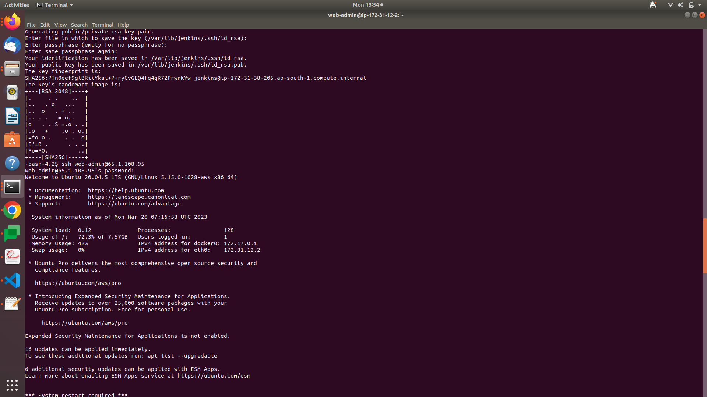
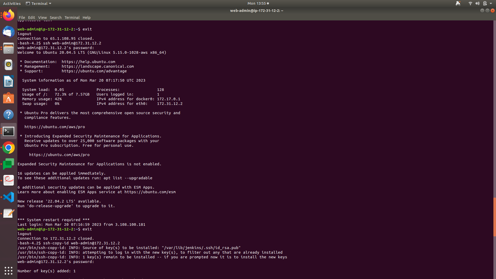
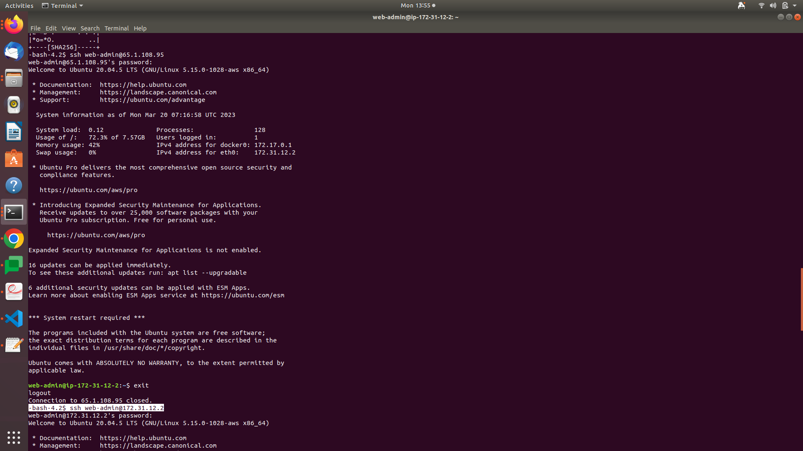
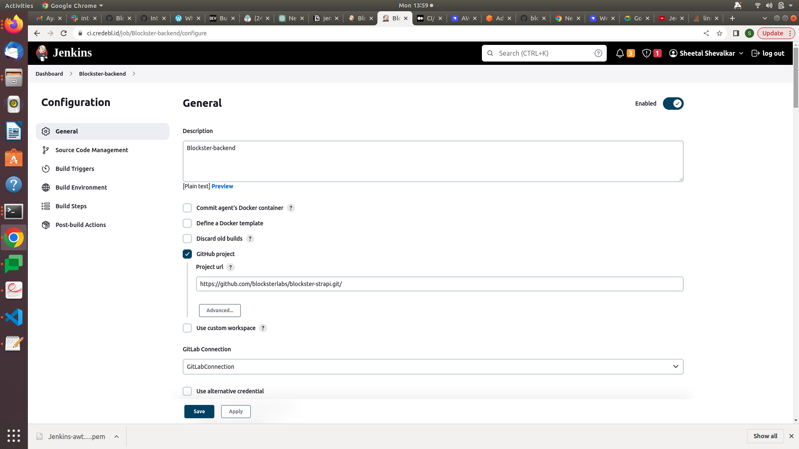
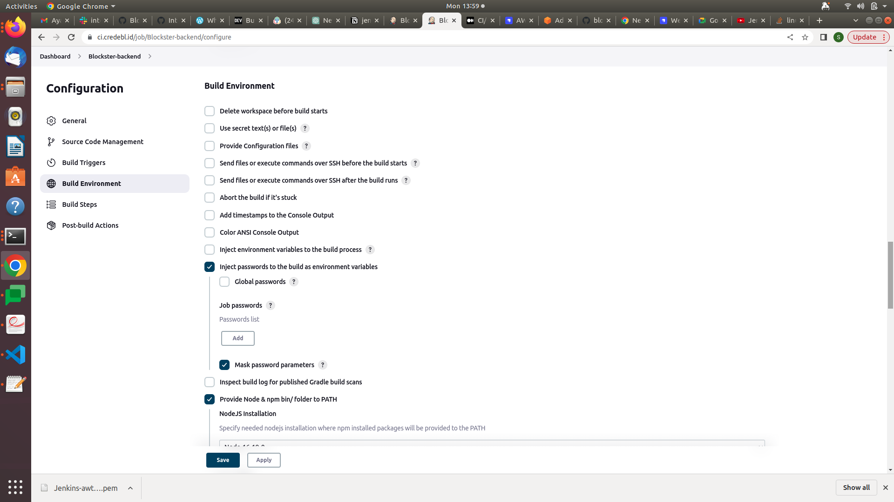
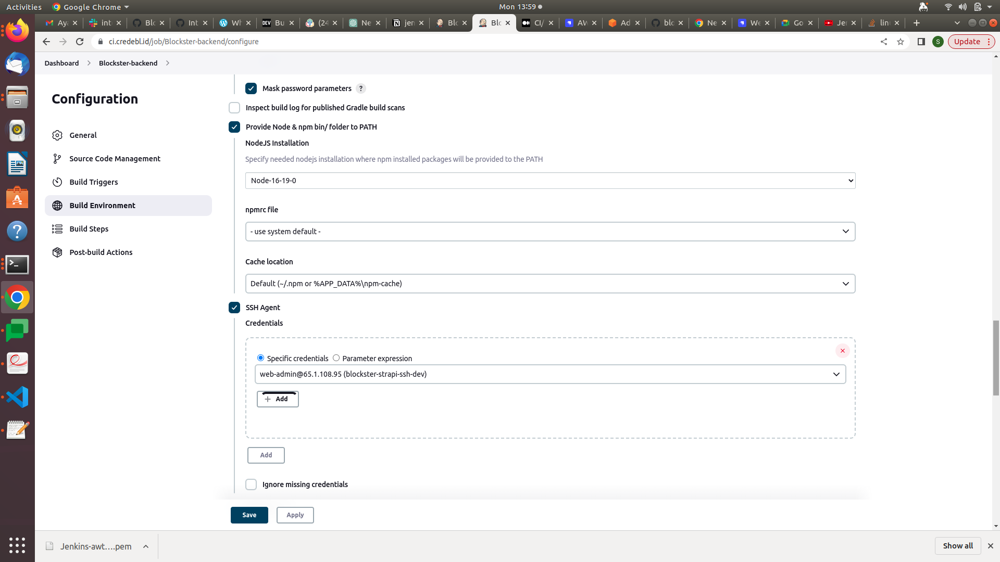

# Jenkins and server connection setup

login jenkins server

```bash
ssh -i Jenkins-awts-server.pem ec2-user@3.108.100.181
sudo su - jenkins
```

<aside>
 on jenkins server-create sshkey

</aside>

```bash
sudo su -jenkins
ssh-keygen
```

<aside>
 on remote server -login- passwordbase authentication yes..

</aside>

<aside>
 genarate password for user

</aside>

```bash
passwd web-admin password
```

```bash
sudo su username
sudo vim /etc/ssh/sshd_config
passworbaswauthentication yes
```

<aside>
 on jenkins server..copy public key to remote server

</aside>

```bash
ssh-copy-id ubuntu@172.32.12.2
ssh-copy-id ubuntu@3.110.202.104
```

<aside>
 try to login with username@ip without pem .try with public ip ten with private ip

</aside>

<aside>
 now you can scp through jenkins

</aside>

<aside>
 jenkins server

</aside>







<aside>
 in jenkins job post build action execute shell

</aside>

```bash
ssh -o StrictHostKeyChecking=no web-admin@172.31.12.2 "cd /opt/blockster-strapi/; git pull; npm i; npm run build; pm2 restart Blockster;"
```







```bash
#ssh -o StrictHostKeyChecking=no credebl-admin@35.188.80.32 "cd /opt/credebl-platform; rm -rf dist docker-compose.yml node_modules package-lock.json package.json libs resources .env agent-spinup/scripts; unzip platformBuild.zip; . /etc/profile; export NVM_DIR=~/.nvm; source ~/.nvm/nvm.sh; rm -rf platformBuild.zip; npm i; pm2 restart all;"
#whoami
#node -v
#npm i
#npm i dotenv
#npm run build
#zip -r BlocksterBuild.zip build config database package.json yarn.lock .env public
scp -o StrictHostKeyChecking=no .env web-admin@172.31.12.2:/opt/blockster-strapi/
#ssh -o StrictHostKeyChecking=no ubuntu@172.31.12.2 "cd /opt/blockster-strapi/; ls"
#ssh -o StrictHostKeyChecking=no ubuntu@172.31.12.2 "cd /opt/blockster-strapi/; sudo chown web-admin:web-admin /opt/blockster-strapi/*"
#ssh -o StrictHostKeyChecking=no web-admin@172.31.12.2 "cd /opt/blockster-strapi/; rm -rf README.md  build  config  database  favicon.png  my-strapi-export.tar.gz.enc  node_modules  package-lock.json  package.json  public  src  yarn.lock; ls;  unzip BlocksterBuild.zip; ls; rm -rf package-lock.json node_modules src BlocksterBuild.zip ; npm i; pm2 restart blockster"

ssh -o StrictHostKeyChecking=no web-admin@172.31.12.2 "cd /opt/blockster-strapi/; git pull; npm i; npm run build; pm2 restart Blockster-strapi;"
```