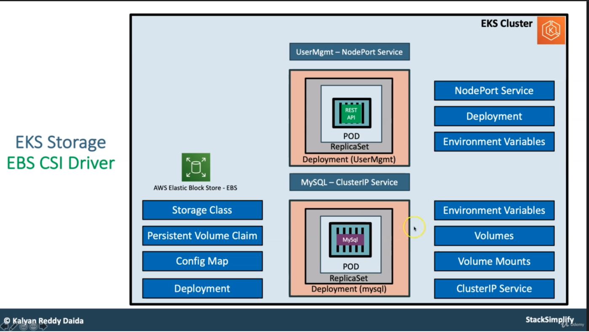
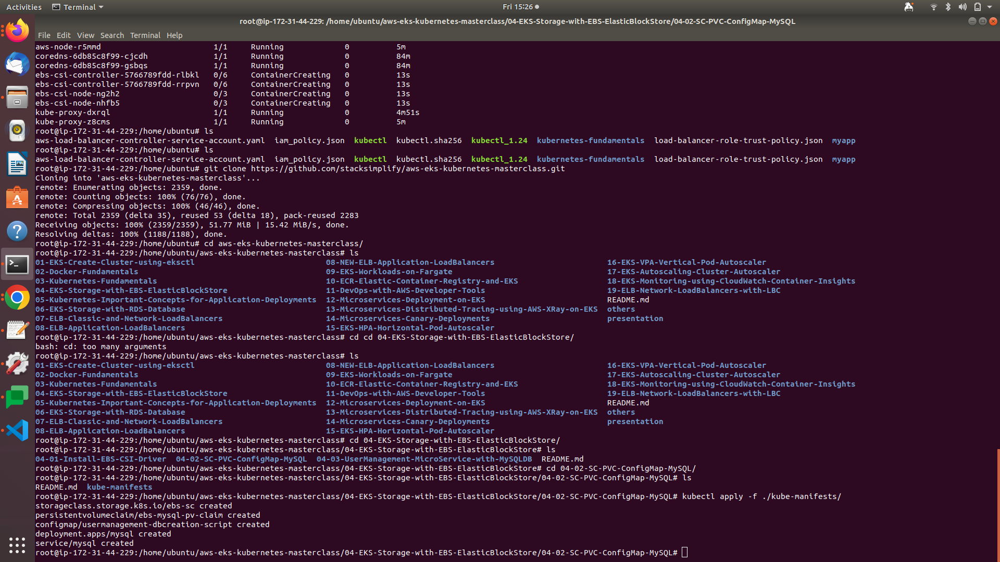

# Kubernetes Architecture




<aside>
 **EKS Storage -  Storage Classes, Persistent Volume Claims**

</aside>

- create a MySQL Database with persistence storage using AWS EBS Volumes

| Kubernetes Object | YAML File |
| --- | --- |
| Storage Class | 01-storage-class.yml |
| Persistent Volume Claim | 02-persistent-volume-claim.yml |
| Config Map | 03-UserManagement-ConfigMap.yml |
| Deployment, Environment Variables, Volumes, VolumeMounts | 04-mysql-deployment.yml |
| ClusterIP Service | 05-mysql-clusterip-service.yml |

<aside>
 01-storage-class.yml

</aside>

```jsx
apiVersion: storage.k8s.io/v1
kind: StorageClass
metadata: 
  name: ebs-sc
provisioner: ebs.csi.aws.com
volumeBindingMode: WaitForFirstConsumer (or imidiate)  # volume az is dynamic we dont need to provide
```

<aside>
 02-persistent-volume-claim.yml

</aside>

```jsx
apiVersion: v1
kind: PersistentVolumeClaim
metadata:
  name: ebs-mysql-pv-claim
spec: 
  accessModes:
    - ReadWriteOnce
  storageClassName: ebs-sc
  resources: 
    requests:
      storage: 4Gi
```

<aside>
 03-UserManagement-ConfigMap.yml

</aside>

We are going to create a `usermgmt` database schema during the mysql pod creation time which we will leverage when we deploy User Management Microservice.

```
apiVersion: v1
kind: ConfigMap
metadata:
  name: usermanagement-dbcreation-script
data: 
  mysql_usermgmt.sql: |-
    DROP DATABASE IF EXISTS usermgmt;
    CREATE DATABASE usermgmt;
```

<aside>
 04-mysql-deployment.yml

</aside>

```jsx
apiVersion: apps/v1
kind: Deployment
metadata:
  name: mysql
spec: 
  replicas: 1
  selector:
    matchLabels:
      app: mysql
  strategy:
    type: Recreate 
  template: 
    metadata: 
      labels: 
        app: mysql
    spec: 
      containers:
        - name: mysql
          image: mysql:5.6
          env:
            - name: MYSQL_ROOT_PASSWORD
              value: dbpassword11
          ports:
            - containerPort: 3306
              name: mysql    
          volumeMounts:
            - name: mysql-persistent-storage
              mountPath: /var/lib/mysql    
            - name: usermanagement-dbcreation-script
              mountPath: /docker-entrypoint-initdb.d #https://hub.docker.com/_/mysql Refer Initializing a fresh instance                                            
      volumes: 
        - name: mysql-persistent-storage
          persistentVolumeClaim:
            claimName: ebs-mysql-pv-claim
        - name: usermanagement-dbcreation-script
          configMap:
            name: usermanagement-dbcreation-script
```

<aside>
 05-mysql-clusterip-service.yml

</aside>

```jsx
apiVersion: v1
kind: Service
metadata: 
  name: mysql
spec:
  selector:
    app: mysql 
  ports: 
    - port: 3306  
  clusterIP: None # This means we are going to use Pod IP
```



```jsx
# Create Storage Class & PVC
kubectl apply -f kube-manifests/ #keep all menifest in one folder and run it

# List Storage Classes
kubectl get sc

# List PVC
kubectl get pvc 

# List PV
kubectl get pv
```

### Create MySQL Deployment manifest

- Environment Variables
- Volumes
- Volume Mounts

### Create MySQL ClusterIP Service manifest

- At any point of time we are going to have only one mysql pod in this design so `ClusterIP: None` will use the `Pod IP Address` instead of creating or allocating a separate IP for `MySQL Cluster IP service`.

## Step-03: Create MySQL Database with all above manifests

```jsx
# Create MySQL Database
kubectl apply -f kube-manifests/

# List Storage Classes
kubectl get sc

# List PVC
kubectl get pvc 

# List PV
kubectl get pv

# List pods
kubectl get pods 

# List pods based on  label name
kubectl get pods -l app=mysql
```

## Step-04: Connect to MySQL Database

```jsx
# Connect to MYSQL Database
kubectl run -it --rm --image=mysql:5.6 --restart=Never mysql-client -- mysql -h mysql -pdbpassword11

# Verify usermgmt schema got created which we provided in ConfigMap
mysql> show schemas;
```

